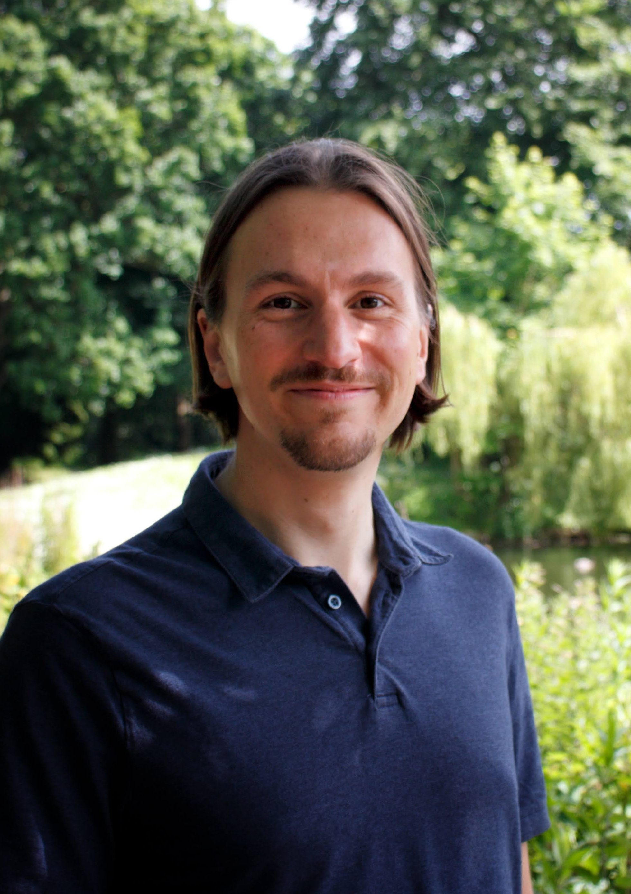
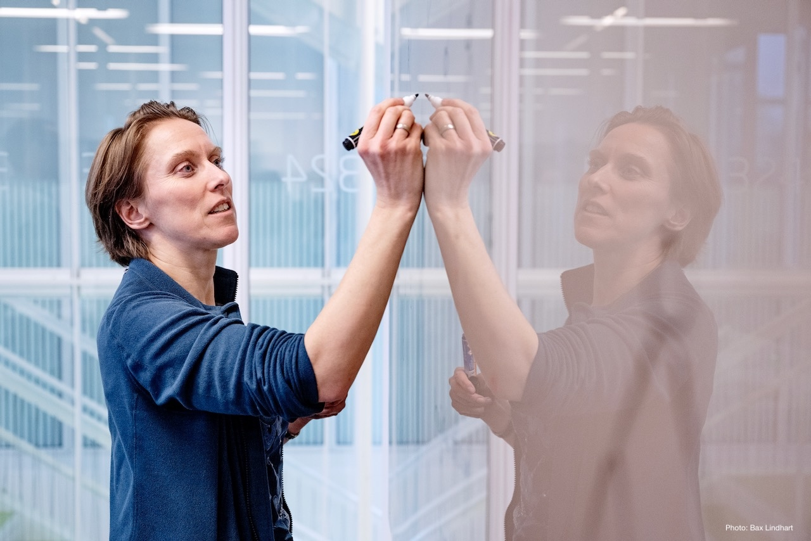
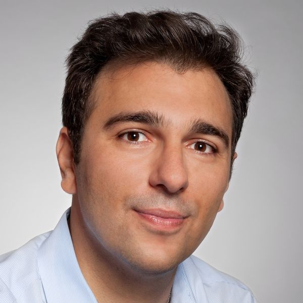

# Sebastian Wild

Affiliation: Philipps University of Marburg · University of Liverpool

Bio: Sebastian Wild leads the Algorithms Group in the Department of Mathematics and Computer Science at Philipps University of Marburg and is Senior Lecturer at the University of Liverpool, UK.  His research focuses on memory-efficient data structures and algorithm engineering.  He is particularly well known for his work on practical sorting algorithms such as Powersort, which is used to sort lists in Python.  Before coming to Marburg, Sebastian was a full-time at the University of Liverpool, UK, and prior to that, a postdoc at the University of Waterloo, Canada. His doctoral thesis on the analysis of multiway quicksort at the TU Kaiserslautern was awarded the GI Dissertation Prize.

Talk: TBA

Abstract: TBA

Picture: 

# Inge Li Gørtz

Affiliation: DTU Compute

Bio: Inge Li Gørtz is a professor in the Algorithms, Logic, and Graphs section at DTU Compute. Her research focuses on design and analysis of algorithms and data structures, especially combinatorial pattern matching including regular expression matching and advanced string indexing, data structures on and searching in compressed data, approximation algorithms, and data structures.

Talk: Locality Sensitive Hashing and Compressed Computation

Abstract:

Locality sensitive hashing is a classic technique with numerous applications, most prominently approximate nearest neighbor queries. In this talk we will discuss how locality sensitive hashing can be used to speed up data compression, compressed computation, and pattern matching.

The key idea in hierarchical relative Lempel-Ziv (HRLZ) is to form a rooted tree (or hierarchy) on a set of strings and then compress each string using RLZ with parent as reference, storing only the root of the tree in plain text.

The HRLZ compression scheme supports efficient sequence retrieval and leads to a twofold improvement in compression on bacterial genome datasets, with negligible effect on decompression time compared to the standard single reference approach.

An effective hierarchy for a given set of strings can be constructed by computing the optimal arborescence of a completed weighted digraph of the strings, with weights as the number of phrases in the RLZ parsing of the source and destination vertices. Instead of computing the complete graph, a sparse graph derived using locality-sensitive hashing can significantly reduce the cost of computing a good hierarchy, without adversely effecting compression performance.

We will also talk about how to use locality sensitive hashing to efficiently construct compressed DFAs. The delayed deterministic finite automaton (D^2FA) compression algorithm introduced by Kumar et al. [SIGCOMM 2006] for compressing deterministic finite automata (DFAs) used in intrusion detection systems exploits similarities in the outgoing sets of transitions among states to achieve strong compression while maintaining high throughput for matching. We will show a simple, general framework for constructing D^2FA based on locality-sensitive hashing that constructs an approximation of the optimal D^ 2FA in near-linear time. We apply the approach to the original D^2FA compression algorithm and two important variants.

Based on joint work with Philip Bille, Max Rishøj Pedersen, Máximo Pérez López, Simon Puglisi, and Simon Rumle Tarnow.

Picture: 

# Charalampos E. Tsourakakis

Affiliation: University of Crete

Bio: Charalampos (Babis) Tsourakakis is an Associate Professor at the University of Crete and a researcher at the Foundation for Research and Technology – Hellas (FORTH). He earned his Ph.D. from the Algorithms, Combinatorics, and Optimization (ACO) program at Carnegie Mellon University, where he also received an M.Sc. from the Machine Learning Department. He subsequently held postdoctoral positions at Harvard and Brown Universities. He holds a Diploma in Electrical and Computer Engineering from the National Technical University of Athens.

Before joining the University of Crete, he was a faculty member at Boston University and a research affiliate at Harvard University. He has also held research positions at Google Research, Meta/Facebook Research, and RelationalAI.

He has received the IEEE ICDM Test of Time Award and the IEEE ICDM Best Paper Award, and has delivered three tutorials at the ACM SIGKDD Conference on Knowledge Discovery and Data Mining. His research focuses on the design of scalable algorithms and machine learning methods for analyzing large-scale datasets, with an emphasis on knowledge graphs and related applications.

Talk: TBA

Abstract: TBA

Picture: 
